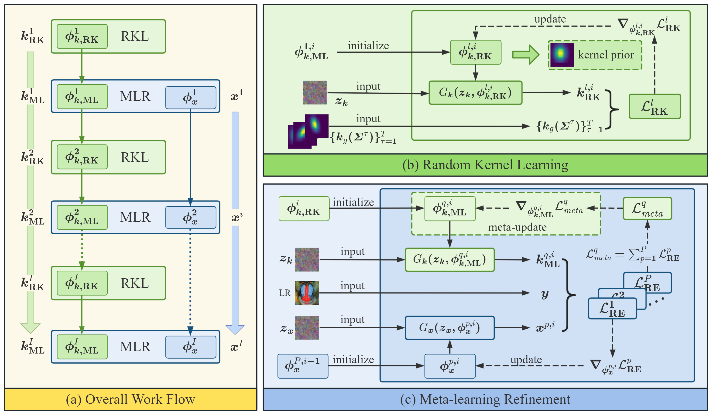
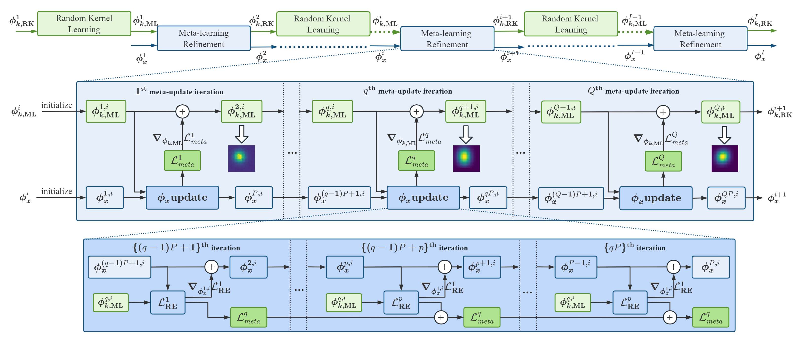
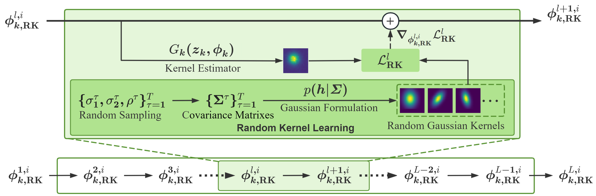

# Meta-learning based Bind Image Super-Resolution Approach to Different Degradations (DDSR)

This repository is the official PyTorch implementation of DDSR to Blind Super-Resolution 
([supp](https://github.com/XYLGroup/DDSR)).

 ---

> Although recent studies on blind single image super-resolution (SISR) have achieved significant success, most of them typically request a supervised training on synthetic low resolution (LR)-high resolution (HR) paired images. This leads to re-training necessity for different degradations and restricted applications in real world scenarios with unfavorable inputs. In this paper, we propose an unsupervised blind SISR method with input underlying different degradations, named different degradations blind super resolution (DDSR). 
It formulates a Gaussian modeling on blur degradation and a meta-learning framework for solving different image degradations.
Specifically, a neural network-based kernel generator is optimized by learning from random kernel samples, referring to random kernel learning. 
This operation provides effective initialization for blur degradation optimization.
At the same time, a meta-learning framework is proposed to resolve multiple degradation modelings on the basis of alternative optimization between blur degradation and image restoration, respectively. 
Differ from the pre-trained deep-learning methods, the proposed DDSR is implemented in the way of plug-and-play and is capable of restoring HR image from unfavorable LR input with degradations such as partial covered, noise, and dark. 
Extensive simulations illustrate the superior performance of the proposed DDSR approach compared to the state-of-the-arts on public datasets with comparable memory load, time consumption, better application flexibility and convenience, and significantly better generalization ability towards the multiple degradations.
><p align="center">
  > 
</p>

## Requirements
- Python 3.7, PyTorch >= 1.7
- Requirements: opencv-python, tqdm
- Platforms: Ubuntu 16.04, cuda-10.0 & cuDNN v-7.5


## Quick Run DDSR
To run the code without preparing data, run this command:
```bash
cd DDSR
python main.py
```

---

## Data Preparation
To prepare testing data, please organize images as `data/datasets/Set5/HR/baby.png`, and run this command:
```bash
cd data
python prepare_dataset.py --model DDSR --sf 2 --dataset Set5
```
Commonly used datasets can be downloaded [here](https://github.com/xinntao/BasicSR/blob/master/docs/DatasetPreparation.md#common-image-sr-datasets).


## Acknowledgement

This project is released under the Apache 2.0 license. The codes are based on [FKP](https://github.com/JingyunLiang/FKP) and [BSRDM](https://github.com/zsyOAOA/BSRDM). Please also follow their licenses. Thanks for their great works.


